# Lab 10

The objective of this lab is to implement grid localization using Bayes filter.

## Pre-lab

After setting up the simulator via the instructions on the lab website, I had two pre-lab tasks to complete

### 1. Open Loop Control

For this task, the robot needed to follow a "square" loop anywhere in the map. We are given functions to set the robot's angular and linear velocity.

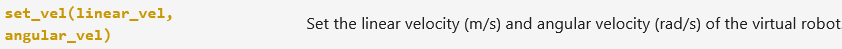

Using this, I wrote some basic movement functions. The velocity commands last indefinitely until another is called, so I included stop commands at the end. 

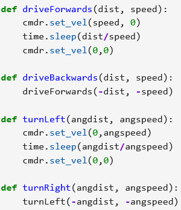

Then, I wrote a loop that performed the necessary commands.

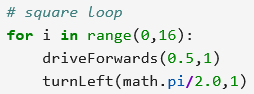

In testing, the robot did not always execute the same exact shape. There were inconsistencies from minor timing variations between delay commands; additionally, the rotation was not a perfect 90-degree angle. The robot deviated from the intended path over time. 

<!-- video url: https://youtu.be/wqJZUglvJyc -->

### 2. Closed Loop Control

For this task, the robot needed a closed-loop obstacle avoidance algorithm. Using the same movement functions, I had the robot turn somewhere else when it detects an obstacle within a threshold. 

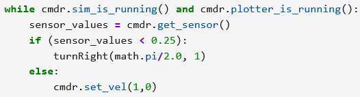

Since the world was constructed with 90-degree corners, I had the robot turn 90 degrees. I was able to avoid most collisions at my original speed of 1 m/s while maintaining a threshold of 0.5 meter, but I wasn't able to increase the speed very much without sacrificing collision frequency. 

Because the sensor is not on the point on the robot which is farthest from its center of rotation (which would be its corners), the robot cannot avoid a collision at a distance of 0 meters. The closest distance the robot can be from an obstacle is dependent on the robot's dimensions. 

This algorithm ignores lateral obstacles, which could cause collisions during turns. This could be corrected by having distances sensors on the left and right sides of the robot to see those obstacles and act accordingly. 

<!-- video url: https://youtu.be/zPP4ZTQRWqE -->

## Lab Tasks

In order to implement grid localization, we had to fill in some function stubs. 

### compute_control

This function takes in current and previous odometry poses and produces the corresponding control input. Motion is broken down into an initial orientation and translation to reach the new xy-position, followed by another rotation to reach the final orientation. Later in debugging I found that I needed to normalize the output angles using the normalize_angle method in the mapper class.

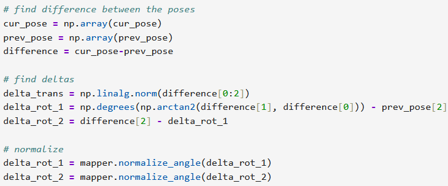

### odom_motion_model

This function takes in current and previous odometry poses and a control input and returns the probability that the control input resulted in the current pose. I followed the formulas from lecture and used the localization class's gaussian method to model noise. 

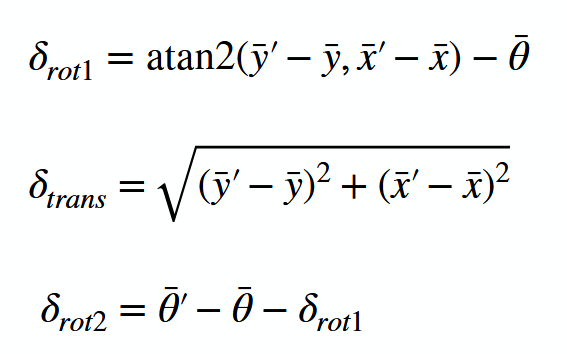

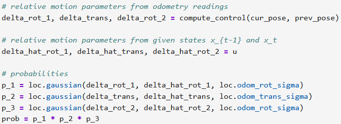

### prediction_step

This function takes in current and previous odometry poses to complete the prediction step. I iterated over the grid elements and summed the probability of each way a previous control input from another grid element could terminate in the current element. I normalize the belief grid to avoid floating-point underflow.

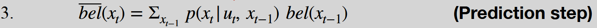

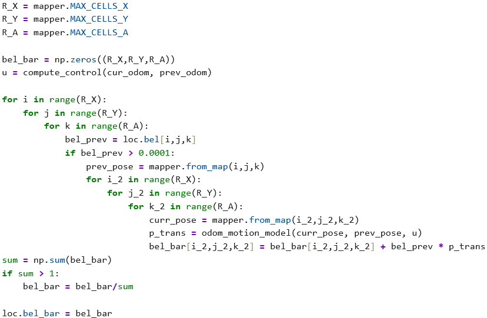

### sensor_model

This function takes in an array of true observations for a particular robot pose and returns the likelihood of each sensor measurement using a predicted Gaussian distribution. 

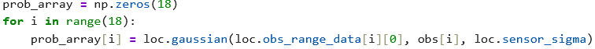

### update_step

This function performs the update step in loc.bel based on loc.bel_bar and the sensor model. Iterating through nonzero grid elements, beliefs are updated using prior and the sensor model data, then normalized. 

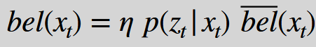

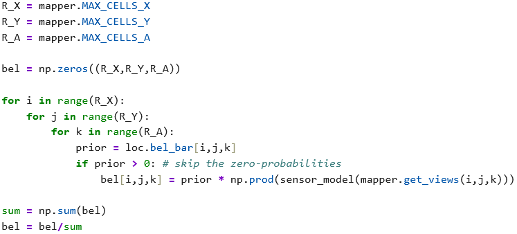

## Results

With grid localization now fully implemented, I used the provided test script to evaluate performance. Based on the video screencapture and final grid screenshot below, the Bayes filter in blue seemed reasonably accurate to the true position in green in spite of very noisy sensor readings in red. This executed in ~60 seconds, which seemed like satisfactory computation time, so I made no further optimizations. 

<!-- video url: https://youtu.be/4U_wVl6akMM -->
