# Lab 11

The objective of this lab is to bring localization with Bayes filter from the simulation in Lab 10 to our physical car robots. 

## Lab Tasks

After setting up the base code, I tested the localization in simulation. After running the base code in the provided simulation notebook, the simualtor generated the following plot of ground truth position (green), sensor model data (red), and updated Bayes filter estimate (blue). The filter output seems like a reasonable estimate of the true path, so this is performing as expected.

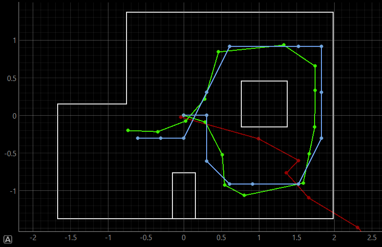

In order to perform the update step, I first had to implement two member functions in the RealRobot class. 

### get_pose

This method returns the current robot pose based on odometry. I adjusted the implementation a bit and hard-coded the four locations in the lab setup, converting units from feet to meters. 

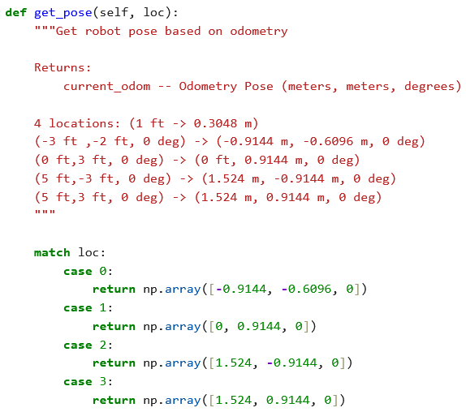

### perform_observation_loop

This method collects the distance data at different angles about the robot's center of rotation in 20-degree increments. Here I use the function from Lab 9 and a notification handler to populate and return an ordered list of distance measurements. The while-loop keeps the thread waiting until all data is sent from the robot. 

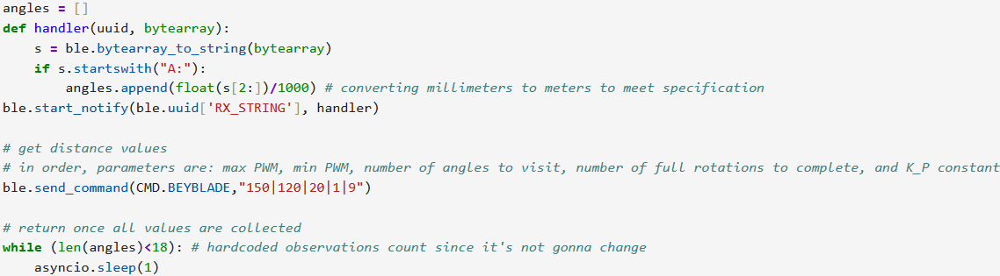

## Results and analysis

<!-- TODO: in addition to data analysis discussion, collect the following data at each point:
    -> polar plot of raw ToF data at each intended angle, ignoring rotation inaccuracy (for now)
    -> plot of Bayes filter returned position vs actual position on the grid
    -> video of data collection at that point
-->

My initial run bore pretty poor results... it seems like the same off-world point is being predicted every time. Below I show the polar plot of measured distance (in mm) at each angle (in degrees) and the resulting localization prediction from the Bayesian filter. Below is the raw collection data, judged against control data collected in simulation at the same points:

### Pose 1: (-3 ft, -2 ft, 0 deg)

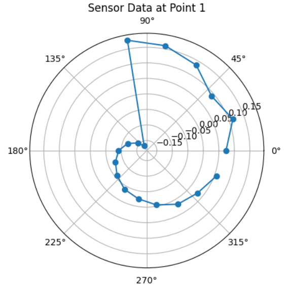
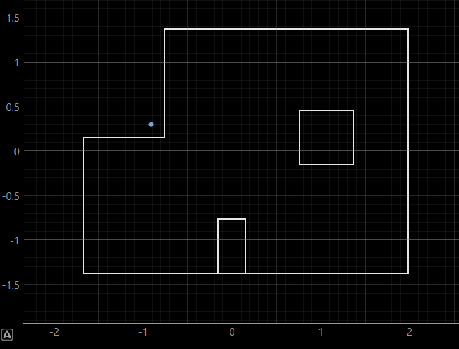
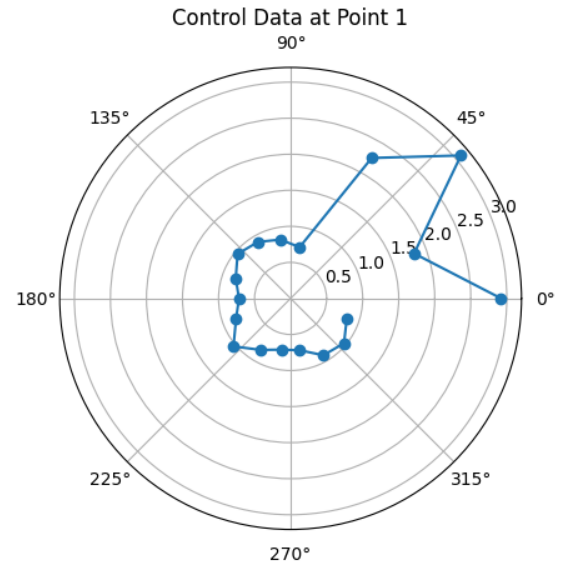
<!-- URL: https://youtu.be/VjgTUMwF4ng -->

<!-- ### Pose 2: (0 ft, 3 ft, 0 deg)

URL: https://youtu.be/wt3LWKJ2d_4 
 -->

### Pose 3: (5 ft, -3 ft, 0 deg)
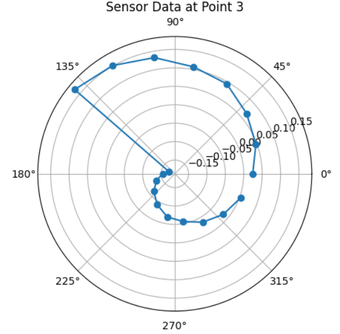
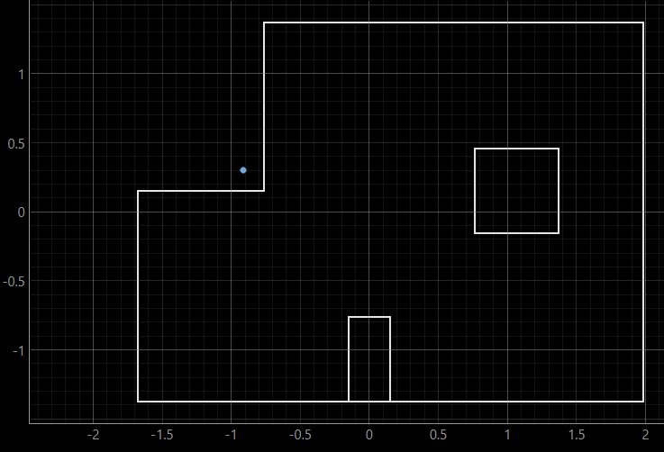
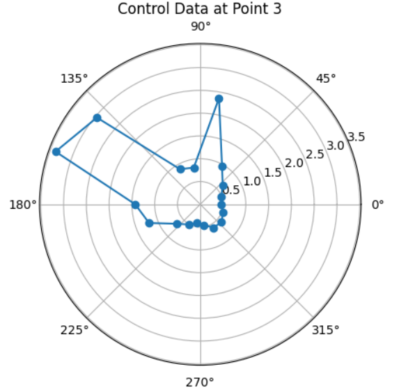
<!-- URL: https://youtu.be/SQO9QNAHMnI -->

### Pose 4: (5 ft, 3 ft, 0 deg)
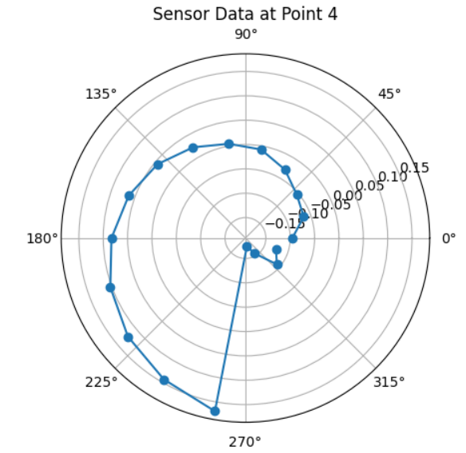
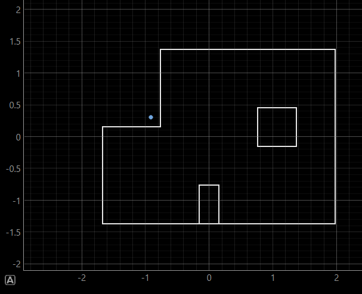
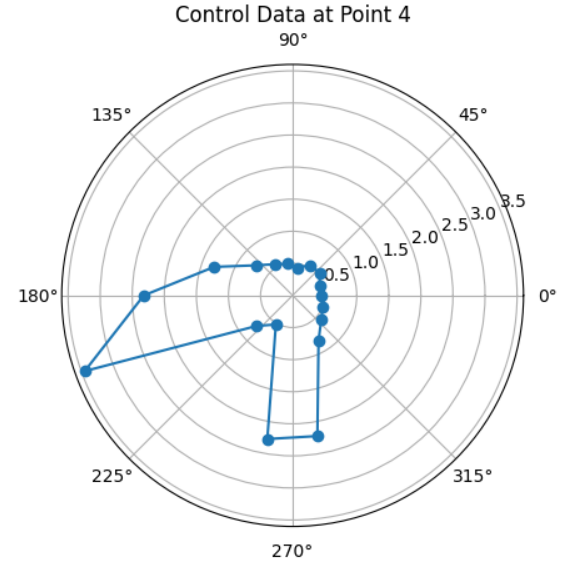
<!-- URL: https://youtu.be/2ZnHffRjMTA -->

The first issue is with the data itself. It seems that the robot is returning negative values in the observation data. Aside from a conversion from millimeters to meters, there is no additional data processing occurring once the data from the Artemis board reaches my laptop, so this is most likely an issue carrying over from Lab 9. There also may have been a confounding factor in taking data measurements with other robots on the field; for instance, detecting another robot at Pose 4 as a wall while taking measurements at Pose 3 would make the negative-y wall seem closer than expected. However, as this would have only affected at most two distance measurements due to the layout of the map, this would have little effect on the shape of the data, but a false corner detection would impact state prediction.  

The second issue is with the senosr initialization. The front ToF sensor was mistakenly set to short-distance mode instead of long-distance mode. This would result in improper measurements outside of the short-distance mode's range of 1.3 meters, per the datasheet, but should not have too much of an effect on the general shape of the data while the intended measurement is still within that point. (For instance, the car should still detect at pose 3 that it is close to a map corner in the positive-x, postiive-y direction.) 

Finally, there were also some movement issues carrying over from Lab 9 that had a significant impact on the data for Pose 4, as shown starting around the 100-degree mark. Based on the other videos, it seems this had minimal impact on the other data sets. 

At Pose 0, while the data does not seem to trace the data after around the 240-degree mark evenly, the robot was able to follow the expected shape to an extent. The graph seems rotated slightly in the counterclockwise direction, which would be explained by angle overshooting, so the robot isn't stopping fast enough when reaching the intended measurement angle. It seems that the closer points directly in the positive-y direction were a bit shaky, likely due to the stutter shown in the video where the robot overshoots the 20-degree measurement.

The shape of the plot for Pose 3 is similarly low-resolution, and seems more rotated in the counterclockwise direction than with Pose 0. The increase in distance measurements after the ~110-degree mark is directly correlated with the stutter movement shown in the corresponding video, but the robot seems to have followed the shape well up until that point. 

For Pose 2, the data is significantly deviant from the control data. This could be related to the sensor mode issue, as the long-distance measurements around 180 degrees could have been interpreted as very low values since the real distance would have been well out of range. This would not explain, however, the significant mismatch around the 270-degree mark and onwards, as the robot fails to detect the critical point in the negative-y direction or the positive-x direction at the nearest points on the respective walls. 

Finally, I also took simulator data at the predicted point, which was the same for all three poses with xy-coordinates of -0.9144 and +0.3048 and an angle of 70 degrees. As expected, this data didn't look anything like any of the previous data sets. The steep differences at certain points in the dataset, such as the low point at Pose 4 at around 180 degrees, could be registering as a very close corner or wall point. The negative readings may also have an impact, as these would be treated similarly to being at a distance very close to 0 from a wall. 

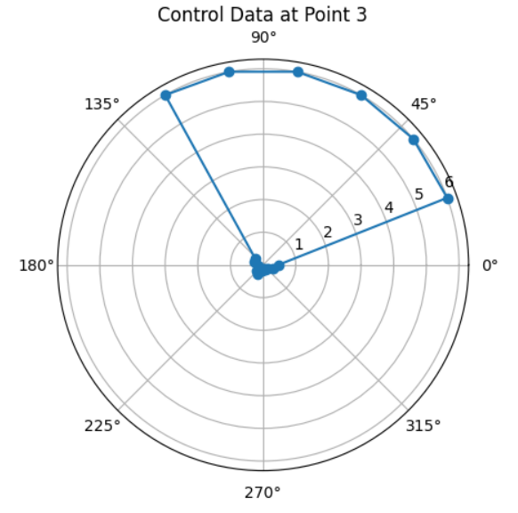

The next steps will be to correct the aformentioned Lab 9 bugs and figure out what is causing the negative value readings in order to move forward. Most of these issues will likely be resolved by switching back to long-distance mode. 