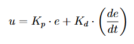
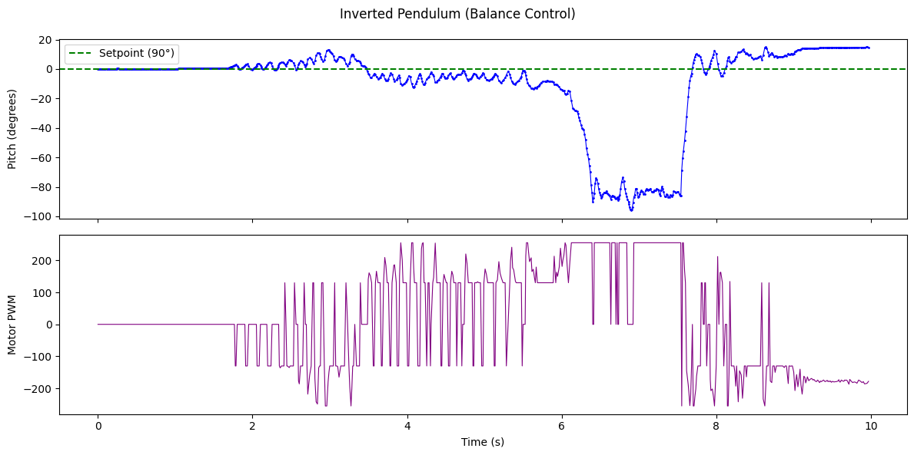

# Lab 12

The objective of this lab is to balance the robot on two wheels in an inverted pendulum configuration using closed-loop control. I collaborated with Rajarshi Das and Rushika Prasad on this lab. Rajarshi designed the initial code architecture and provided the robot, Rushika handled the Jupyter notebook integration for remote gain tuning and data logging, and I performed the physical testing with Rajarshi's assistance.

## Approach

We chose to start the robot in the upright position and stabilize it with a PD controller, rather than attempting to drive forward and flip into a wheelie. This allowed us to focus on tuning the balance controller without also needing to time the flip correctly. We also chose to add some weight to the base of the robot (we added some screws to the battery compartment) for more stability.

For our experimental setup, one person holds the robot upright while another runs the BALANCE command from the Jupyter notebook, which provides a three-second countdown before activating the controller. At the moment the command is received, the firmware zeroes the integrated pitch so the current orientation becomes the setpoint at 0 degrees.

## Controller

The balance controller is implemented in runPitchPID() in pid.cpp and runs when pid\_mode is set to 2. Each iteration, it reads the IMU, integrates gyrY() to obtain the current pitch angle, and computes a motor command based on the error between the pitch and the 0-degree setpoint. Below is the relevant section of the controller code:

```cpp
// Integrate gyro for pitch
unsigned long now_us = micros();
float dt = (now_us - prev_orient_time_us) / 1000000.0;
if (dt > 0 && dt < 0.1) {
    pitch_g += myICM.gyrY() * dt;
}

float error = pid_setpoint - pitch_g;

// P term
float p_term = kp * error;

// I term with anti-windup
i_term += error * ki * dt;
i_term = constrain(i_term, -300, 300);

// D term: use raw gyrY() directly (pitch angular rate)
float gyro_rate = myICM.gyrY();
float d_term = kd * (-gyro_rate);
if (abs(d_term) < 1.0) d_term = 0;  // LPF threshold

float raw_output = p_term + i_term + d_term;
int motor_cmd = constrain((int)raw_output, -255, 255);

// Brake if fallen or at target
if ((abs(error) <= 2.5) || (abs(error) >= 87.5)) {
    brakeMotors();
}
```

The proportional term provides a restoring force proportional to the tilt angle. The derivative term uses the raw gyro angular rate directly, rather than numerically differentiating the error signal. This avoids amplifying high-frequency noise that would result from discrete differentiation. A small LPF threshold zeros out very small D values to reduce motor chatter. A deadband is applied to prevent the motors from buzzing at very small error values, and a brake zone is active within 2.5 degrees of the setpoint. The controller also brakes if the error exceeds 87.5 degrees, meaning the robot has fallen over. No integral term was used, as the balance point does not drift significantly on a flat surface.

## Inverted pendulum dynamics

An inverted pendulum is inherently unstable. When the robot tilts by angle θ from vertical, gravity exerts a torque proportional to sin(θ) that pulls it further from the upright position. For small angles, sin(θ) can be approximated as θ, yielding a linearized equation of motion:



(Here, g is gravitational acceleration, L is the effective pendulum length from the axle to the center of mass, and u is the corrective acceleration from the wheels.)

The PD controller computes the motor output as u = Kp·e + Kd·(de/dt), where e is the difference between the setpoint and the current pitch. The proportional term acts as a restoring spring that pushes the robot back toward vertical. On its own, this would cause oscillation around the setpoint, as the controller has no mechanism to anticipate when it is approaching zero and should begin slowing down. The derivative term opposes the rate of change of the error, functioning as a damper that reduces overshoot.

The small-angle approximation breaks down at larger tilt angles. Beyond approximately 10 degrees, the actual gravitational torque grows faster than the linear model predicts, so the controller underestimates the required correction. This is consistent with what was observed during testing.

## Gain tuning

Gains were sent over BLE using the SET\_PID\_GAINS command, which allowed tuning without reflashing the firmware. Over the course of more than 20 runs, we adjusted the gains to find values that worked. With low Kp values, the robot simply fell over on the first tilt, as the correction was not fast enough. There was no oscillation at all with insufficient gains. Kp was gradually increased until the robot could push back against a tilt, and then Kd was added to damp the response.

Two sets of gains were found to work depending on the surface. On carpet, Kp = 3, Ki = 0, Kd = 2 was sufficient, as the added friction from the carpet helped the wheels maintain traction. On hardwood, more aggressive gains were required: Kp = 8, Ki = 0, Kd = 3. The reduced friction on the smooth surface meant the wheels were more prone to slipping, requiring stronger and faster corrections.

## Debugging

Several early attempts failed because the D term was reading gyrZ() instead of gyrY() for the derivative. Since the derivative was reading the wrong rotational axis entirely, it was responding to motion that the controller did not need to correct, while ignoring the motion it did. Once the axis was corrected, the controller began damping oscillations as expected.

Getting BLE communication working also required some effort, as each team member had a different coding style. Rajarshi's robot had a recurring issue where it would disconnect from BLE immediately after the balance command was sent. After troubleshooting the connection flow, this was resolved.

## Jupyter notebook

The notebook (balance\_run.ipynb) handles the full testing workflow over BLE. It sends the gain values with SET\_PID\_GAINS, starts the balance run with BALANCE after a three-second countdown, waits for the firmware to finish (the default timeout in the firmware is 10 seconds, set by pid\_duration), and then pulls logged data back with GET\_PID\_LOG. Each log line contains a timestamp, the pitch angle, and the motor command. The notebook parses these into a DataFrame and generates plots. Below is the relevant section of the notebook code:

```python
# Set gains remotely
KP, KI, KD = 3, 0, 2
ble.send_command(CMD.SET_PID_GAINS, f"{KP}|{KI}|{KD}")

# Countdown then start
for i in range(3, 0, -1):
    print(f"Starting balance in {i} ...")
    time.sleep(1.0)
ble.send_command(CMD.BALANCE, "0")
```

One firmware fix was required. The GET\_PID\_LOG handler in commands.cpp was sending pid\_yaw\_array for all non-position modes, but the balance controller writes pitch data to pid\_pitch\_array. A conditional check for pid\_mode == 2 was added so the correct data array is transmitted.

## Results

Below are videos of three attempts at balancing the robot, as well as corresponding motor input and IMU pitch measurement data:

### Attempt 1
[](https://www.youtube.com/watch?v=kW2kspywVE0)


### Attempt 2
[](https://www.youtube.com/watch?v=kW2kspywVE0)


### Attempt 3
[](https://www.youtube.com/watch?v=kW2kspywVE0)


The best run achieved approximately 7 seconds of balancing. The robot remained upright with visible twitching as the controller made small corrections. Within about 10 degrees of the setpoint, the corrections were quick and consistent. Beyond that range, recovery became unreliable, and the robot eventually tipped too far to one side and fell. The fall was almost always to the left, suggesting a possible mechanical asymmetry in the chassis or wheel friction, or a small accumulated bias in the gyro integration.

Below are the pitch angle and motor command plots from the run:


Below is the tracking error relative to the 0-degree setpoint:


## Discussion

The controller successfully demonstrated short-duration balancing. The primary limitation is gyro drift from integrating the angular rate to obtain pitch. Any sensor bias accumulates over time and shifts the effective setpoint. A complementary filter combining gyro and accelerometer data would mitigate this, but was not implemented.

The consistent leftward fall could potentially be corrected by applying a small offset to the setpoint to compensate for the asymmetry. This was attempted briefly but there were not enough remaining runs to fully calibrate the offset.

Collaborations: Rajarshi Das (robot and initial code architecture), Rushika Prasad (Jupyter integration for remote tuning and data logging), and I performed testing with Rajarshi's help. Claude was used for assistance with the report.