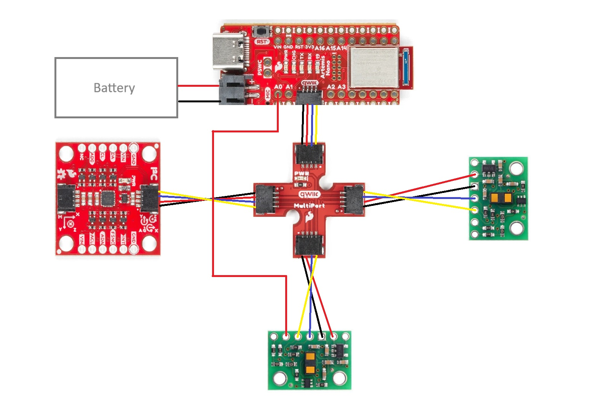
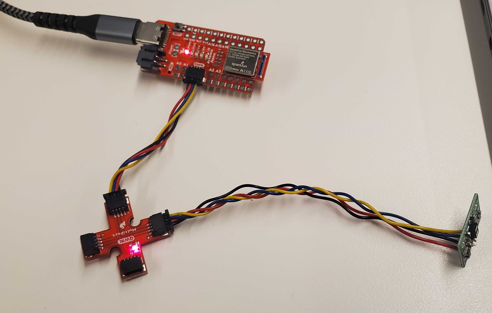
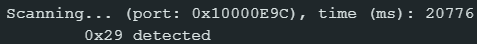

# Lab 3

The goal of this lab is to familiarize us with the Sparkfun VL53L1X time-of-flight (ToF) sensors and to explore parametric impact on effective use with our car robots in terms of sampling speed and value in sensor readings. 

##  Prelab

According to the VL53L1X datasheet, the I2C bus on the ToF sensors default to device address 0x52. 

I will adhere to the wiring diagram shown below. Having one ToF sensor in the front of the robot is clearly valuable for observing obstacles directly in the robot's path and adjusting accordingly. I wanted vision on one side of the robot so that it can observe obstacles or maze border walls to its side, which would otherwise require a 90 degree turn in either direction that could sacrifice movement efficiency. The decision of right side over left side was arbitrary, and obstacles on the left side will be missed without rotating to change the ToF sensors' field of vision. 

In the diagram below, red connections from the QWIIK board to the sensors correspond to VIN, black connections to GND, blue connections to SDA, and yellow connections to SCL. There is one stray red connection from the XSHUT port on the side sensor to the A0 port on the Artemis board for later use in supporting both ToF sensors. 

## Lab Tasks

### One sensor

After clipping the ends of two QWIIC cables and soldering one to each ToF sensor, I tested them with the RedBoard Artemis Nano. I connected the first sensor, QWIIC breakout board, and Artemis board as shown below: 

Running the Example05_wire_I2C file from the Apollo3 library, I scanned the breakout board to confirm connection to the ToF sensor. I initially expected an address of 0x52 as aforementioned, but read an address of 0x29 instead. This made sense in the context of the least significant bit signaling read/write. With the original address of 0x52 being 0b1010010, removing that last bit yields the true I2C address of 0b101001, or 0x29.

<!-- Discussion and pictures of sensor data with chosen mode -->

I chose to use the short-distance mode. The datasheet showed a consistent maximum distance of ~130cm for the short-distance mode, which seems sufficient for tasks such as navigating a maze. While the long-distance mode did reach up to 360cm in ideal conditions, its significant sensitivity to ambient light and target reflectance suggests the short-distance mode is more appropriate. 

<!-- 2 ToF sensors and the IMU: Discussion and screenshot/video of sensors working in parallel -->

### Two sensors

I now have both ToF sensors connected to the breakout board. Both sensors default to the same address, so I had to change the address of one of the boards. I connected a wire from the XSHUT port on one board to a pin on the Artemis (arbitrarily picking A0). Now,  I can set XSHUT low during setup, change the address of the board, and then set it high again to wakeup the sensor with a new address. 

I made some adjustments to the Example1_ReadDistance code to display both sensor outputs. In the video, I show both sensors actively making independent readings. As I adjust the position of each one individually, the appropriate sensor output changes accordingly. 

<!-- insert 2 sensor video here -->

### Three sensors

Finally, I connect the IMU to the third slot on the breakout board. The IMU's I2C address is 0x69, which is different from the other two addresses, so no other changes need to be made. 

<!-- insert 3 sensor picture here -->

Like before, I demonstrate all three sensors making measurements, using the 

<!-- Tof sensor speed: Discussion on speed and limiting factor; include code snippet of how you do this -->

<!-- Time v Distance: Include graph of data sent over bluetooth (2 sensors) -->

<!-- Time v Angle: Include graph of data sent over bluetooth -->