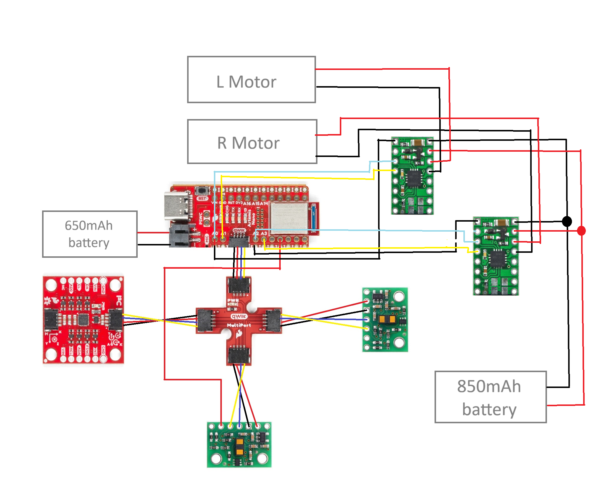
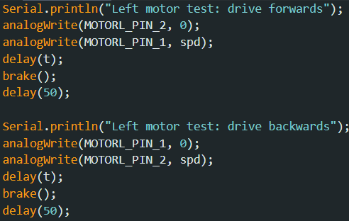
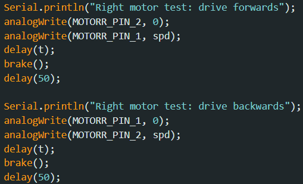
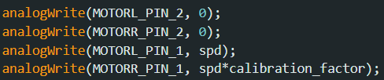

# Lab 4

The purpose of this lab is to become familiar with the dual motor drivers.

## Prelab

In mounting my sensors and motor drivers, I had the circuit diagram below in mind. The sensors are connected as they were in Lab 3, with the extra XSHUT input moved from pin A0 to pin A5 on the Artemis board. I needed analog connections for the motor drivers, so I route their inputs from pins A0, A1, A2, and A3 on the board. Note the distinct power sources for the motors and Artemis board to support greater power consumption from the motors.

## Motor controllers

Each motor driver had its inputs and outputs hard-wired in parallel to deliver extra current to the motors without risk of overheating the chips. I followed the connections for one motor controller on the car diagram, initially replacing the motor battery with a DC power supply for troubleshooting purposes. I set the power supply to 3.7 V to mimic motor battery conditions. 

I wrote a simple test in Arduino to confirm functionality of the motor drivers. I had the following functions to move one motor forwards and then backwards, calling them in a new command to be called from my laptop. This setup performed as expected.

<!-- TODO : put video of 1 motor moving -->

The next step was to follow a similar procedure to get both motors up and running. I added code that simply mirrored the previous excerpt for the other motor and switched off of the power supply to the 850mAh battery for the motors. In this test, I have both motors run forwards and then backwards for a short time.

<!-- video url: https://youtube.com/shorts/qTSaTlnqGZE -->

## Car assembly

With fully functional motor control, I assembled everything in my car. In the diagram below, I take the side with the IMU as the front of the car, and the side with the Artemis board as the back. 

The ToF sensors are hard to see, but they're mounted on the front and left sides roughly perpendicular to the ground. (In hindsight, I should have swapped the long QWIIC cable on one ToF sensor with the short cable connected to the IMU.)The 650mAh Artemis battery is under the Artemis board, and the 850mAh motor battery (not shown) is in the original battery compartment and connected through the hole next to the motor drivers. Many of the wires are zip-tied together over the top, and the rest run between the motors and the plastic frame of the car.

In testing different input values for the controller, I looked for a lower limit for PWM values. I found that this limit was around 45 while freely spinning in the air, around 50 for forward movement on the ground, and around 130 for grounded rotation. 

I tested the forward movement of the car and found that the right-side motor rotated faster, so I weighted its speed down by a small factor. I arbitrarily started with 0.9, which happened to be very effective in straightening movement. 

Here, I set the car atop a tape measure behind the 6-foot mark. The car moves forwards until it clears the tape.

<!-- video link: https://youtu.be/e2TQTWl9WZI -->

Finally, for an open-loop test, I had the car do figure-eights around the legs of my dining-room chair in the video below. 

