# Lab 5

## Prelab

Per the lab handout recommendation, I set up a debugging system before starting this lab. Given some PID control command for the robot, I called this command with user-input values for K_P, K_I, and K_D. The robot stores P, I, D, and motor control speed in separate arrays with a separate timestamp array. These values are collected until the goal is reached, or until 5 seconds pass if this does not occur. Beyond this, I also adjusted the data to avoid values too low to move the robot (~50 PWM from lab 4) and above 255, since that's the maximum input value for the motor drivers. Negative speed values were interpreted as moving the car backwards.

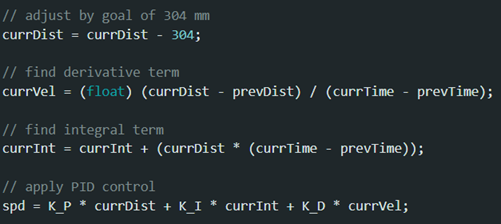

All of these data points are then sent to my laptop via Bluetooth, collecting data using the same method as Lab 3. I collect motor PWM input and proportion and derivative data (integral was unused) alongside time data in separate arrays on the Artemis board and send data points one-by-one to my laptop after program execution. 

## Lab Tasks

For my PID controller, I chose to focus on proportion and derivative. It made sense to include a derivate term in my attempts to speed up the time it takes the car to get significantly close to the target distance. 

My initial results seemed most fruitful when I set K_P = 0.05 and K_D = 7. To assess effectiveness, I looked at how long it took the robot to reach a small "oscillation" phase, and how long afterwards it took to come to a complete stop. (Below is a sample test at a distance of 2 m.)

<!-- TODO : insert 2m video here -->

I primarily tested this at distances of 2, 3, and 4 meters, switching to the long-distance mode on the front ToF sensor to support this. While top speeds were generally the same, I did notice less oscillation at farther distances on average.

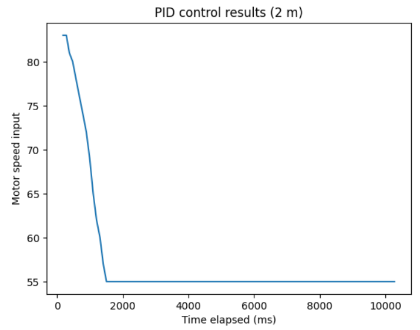
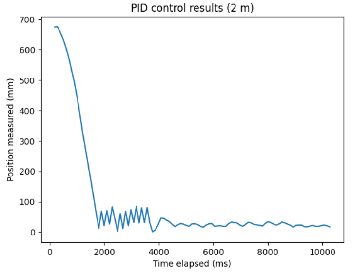

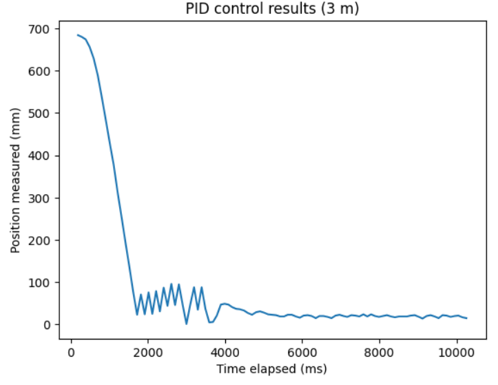
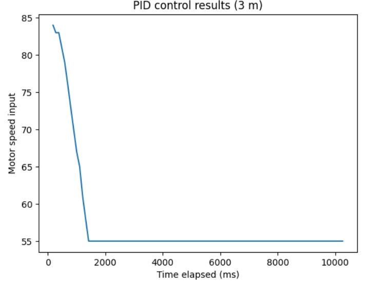

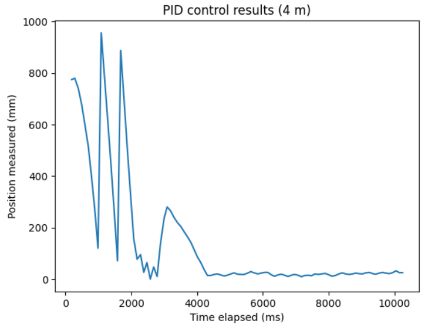
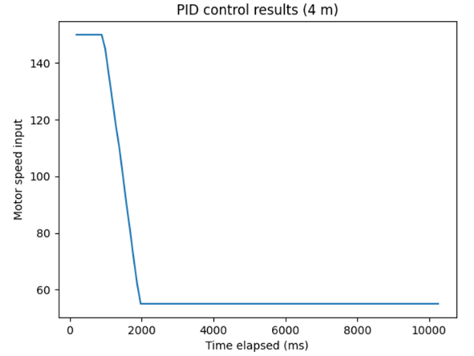

My original implementation only updated the PID output at about the same rate as the ToF updates themselves, which was around 1 measurement per 100 milliseconds. I tried a predictive method based on previous values that recalculated the motor speeds regardless of whether the ToF sensor had a new reading by replacinig the while-loop wait with the following:

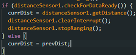

This resulted in very similar behavior that generally ended earlier than previous attempts, as demonstrated below in the 3 meter case. The original sample size of 100 data points terminated nowhere near the wall.

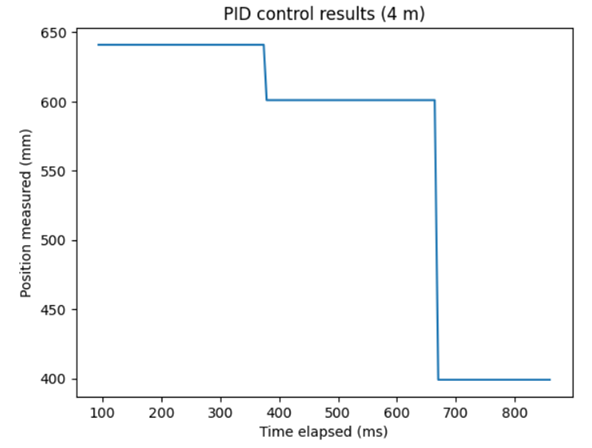

After increasing to 500 data points, the car overshot hard enough to actually climb up the wall for a moment on the front wheels before coming back down (which I unfortunately could not capture via camera).

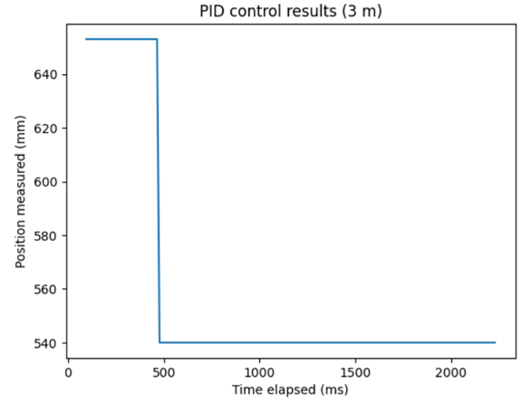

With this adjustment, the PID control loop now runs at a new rate of 1 measurement every 3.24 milliseconds, a little over 30 times faster than before, at the cost of a significant amount of movement accuracy. 

Finally, using an extrapolation approach, the following snippet calculates the next datapoint based on the previous two datapoints instead of reusing the same value. I store these values in the derivative array anyways, so I simply replace the else-branch from before with the following line.

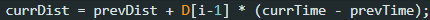

The result was somewhat stuttered movement. Instead of what would be a consistent overshoot from stark changes in movement speed, those changes were instead applied to the derivative (and it did end up bumping into the wall again...). 

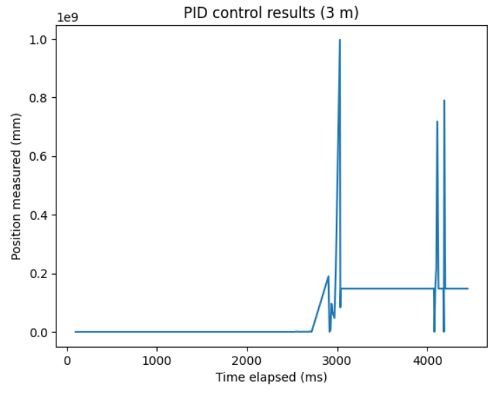