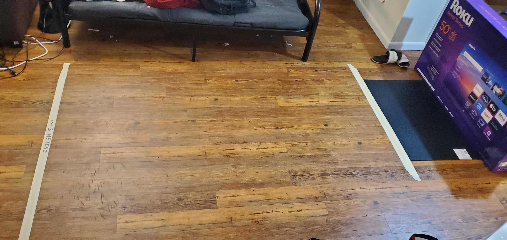
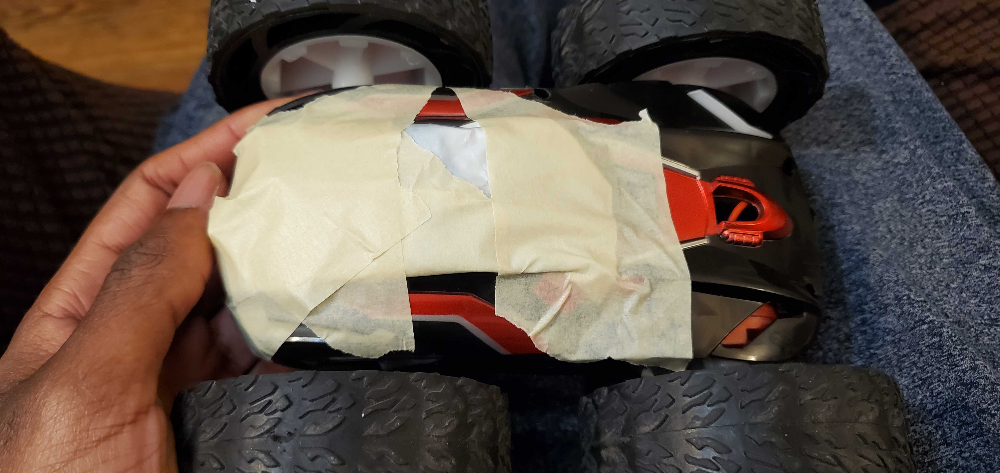
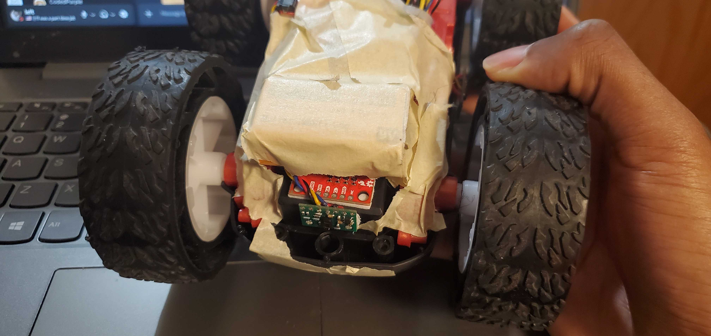
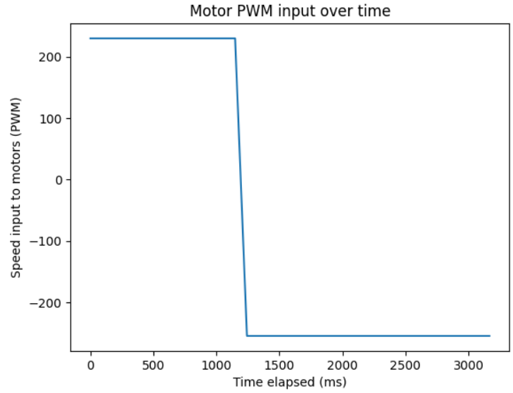
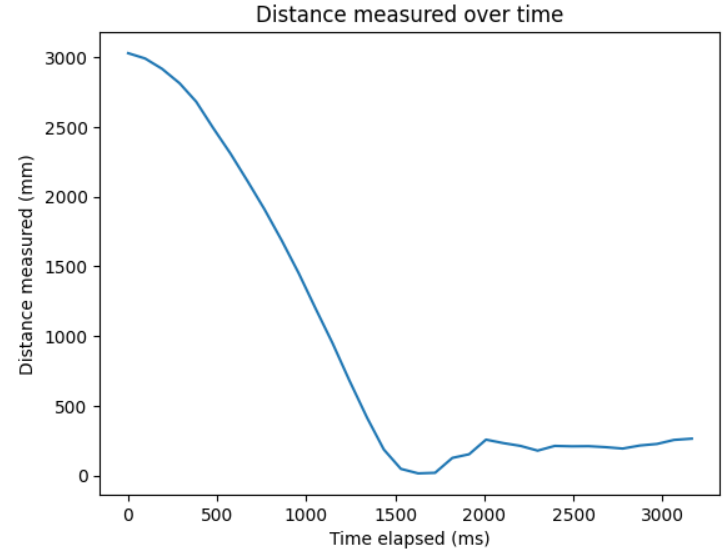
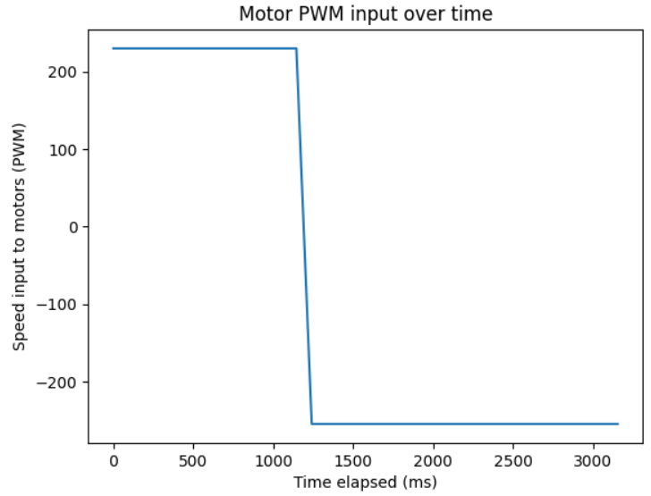
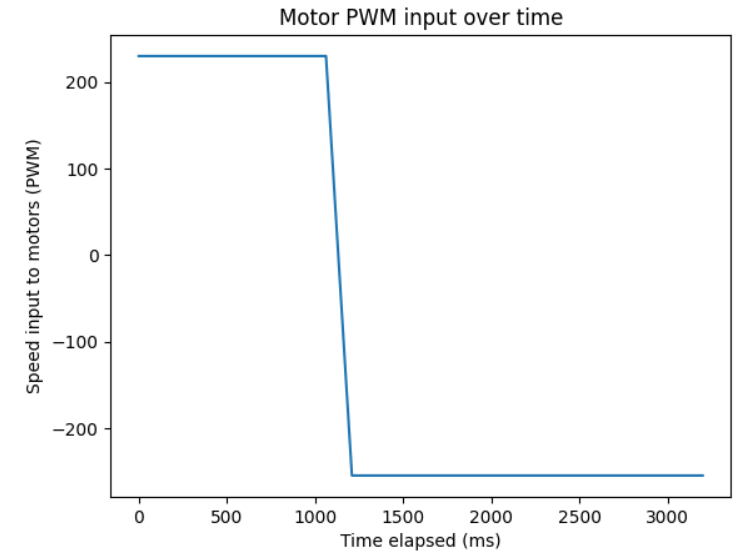
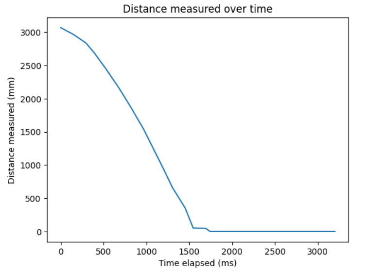
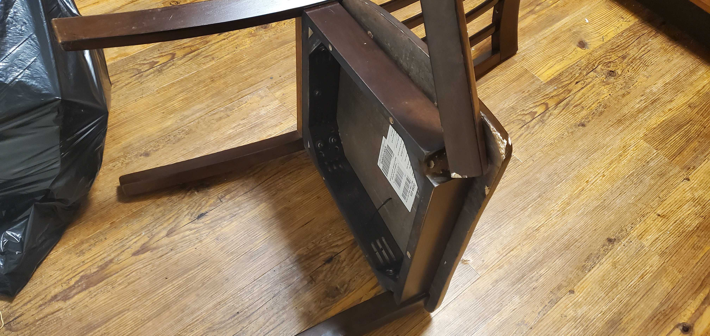

# Lab 8

The objective of this lab is to put everything together from the last few labs to do cool stunts with our awesome robots!

## The Stunt

In the picture below, I have set up the lab scenario for the flip in Task A. I use the cardboard box as a barrier with foam padding to prevent damage to the robot. A labeled line of masking tape lies 3 meters from the box (give or take ~5 millimeters) and an adhesive pad lies in front of the box so that its center is 1 foot from the box. I also added a sheet of foam padding during testing (not shown) which was removed in my final result videos. The car should approach the wall from past the line of tape, perform a flip around the center of the pad, then cross the line of tape again. 

## Design Choices

Based on the details of the stunt, my control program for the stunt was fairly straightforward:

1. Drive motors forwards at max speed to accelerate at the wall while reading front-side Time-of-Flight (ToF) sensor data to detect distance from the wall. 
2. When this distance falls under a certain threshold, reverse motor inputs backwards. (This executes the flip.)
3. Wait a moment to make sure the stunt is complete, then back away from the wall until the car is on the other side of the 3-meter line.

I decided to hard-code the return trip segment instead of using the ToF sensor again. The car is flipped over during this segment, so the ToF sensor is facing away from the wall and will not provide helpful information anymore, so I fixed a return trip duration (i.e., the duration of the reverse PWM signal) to 2 seconds. 

In order to execute this, I used an external binary "phase" variable and had the robot move strictly forwards during phase 0 (approaching the wall) and strictly backwards during phase 1 (retreating to the 3-meter line). Falling under the distance threshold during phase 0 switched the phase to 1, and exceeding the time threshold during phase 1 ended the movement segment of the program and began returning debug data to my laptop.

I made some small adjustments to the code and to the robot during testing. I manually tuned the distance at which the robot attempts the flip higher to make sure it was attempted on the pad and to avoid hitting the wall. To maintain a high speed of 230 PWM, I ended up using a very far distance of 1000 millimeters to begin the flip, which was performed at the midpoint of the mat fairly consistently. 

To aid in flipping over the robot, I had to add weight to the front. I originally added a bag of nails to the motor battery compartment on the bottom, but this wasn't enough disruption in center of balance to get the robot to flip over in testing.

I later adjusted this by adding weight to the top of the front side instead of the bottom. There wasn't a lot of space, so I swapped the bag of nails for a 9-volt battery and taped it over the IMU sensor. This was enough to allow the robot to flip over, and left barely enough clearance for a smooth return trip. 

## Results

Below I present three successful attempts. Note that as aforementioned, the ToF data after the flip occurs is no longer representative of how far the car is from the wall. 

Attempt 1:

<!-- TODO: attempt 1 video -->
<!-- URL: https://youtu.be/DuO6CGjmiCg -->

Attempt 2:

<!-- TODO: attempt 2 video -->
<!-- URL: https://youtu.be/ud7HXthPs58 -->

Attempt 3: 

<!-- TODO: attempt 3 video -->
<!-- URL: https://youtu.be/GnO_tfd9SPQ -->

## Bloopers...?

I had some issues with an early test run that led to rather unfortunate behavior. In the clip below, my car overshoots the mat, hits the wall, then takes a tour under my couch and makes a sharp left to go straight into my room (I was unable to capture this part on camera).

<!-- TODO: blooper video -->
<!-- URL: https://youtu.be/bdTtVM6LTTU -->

For reasons science still can't explain, it managed enough force to break a leg off of the desk chair in my room. It's totally unusable now...

<!-- TODO: chair picture -->

I went into my room to stop the car, but it had already stopped itself... apparently the car's wheels caught stray hair from under the couch, which wound up in the wheels so tightly that all four wheels were locked together. (I chose to omit this picture.)

Here's what (I think?) actually happened.

The bug in my code was that I was improperly using brakes. In my phase 1 code, I called a brake function after the timing threshold was cleared so that the robot would stop after clearing the 3-meter line, but it would only run after this condition was met, and was not called outside of the for-loop. I did not correct this issue until well after I already finished the lab, but it happened to be an issue for this specific attempt in combination with a wiring issue: the QWIIC port on my Artemis board has a rather weak and finnicky connection that tends to disconnect in response to very awkward physical stimuli. 

So on this test run, during which the wiring issue inevitably disconnected my sensors, the commands checking for sensor data ran very quickly (they had no data to read) to progress the rest of the loop much faster than the timing threshold during phase 1. This resulted in termination of the loop without the brake command, so the brake function wasn't called at the end of the program, which led to the harrowing events above. 
