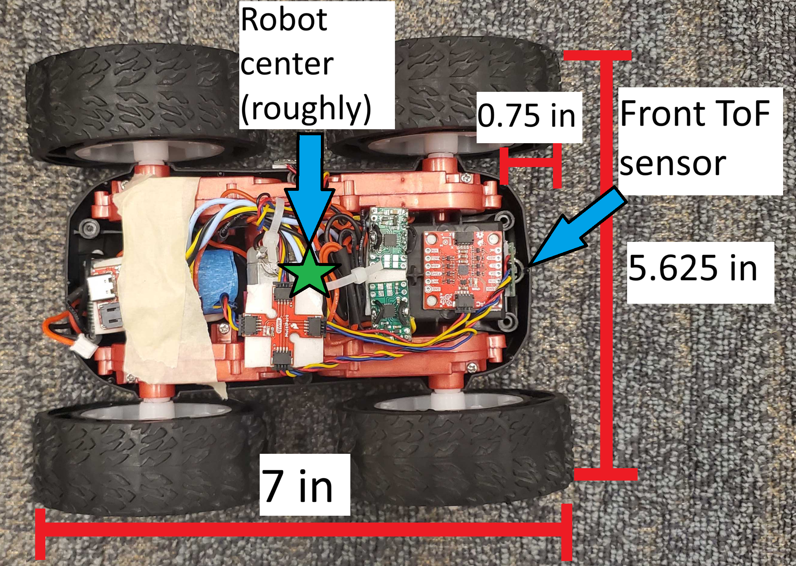
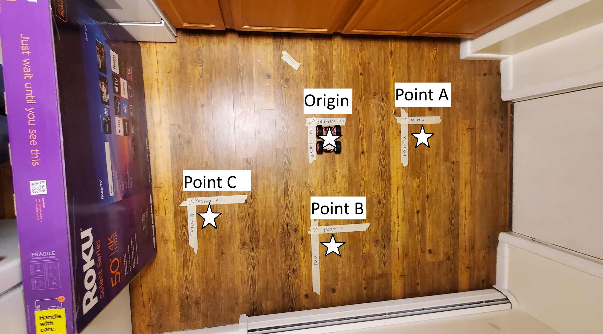
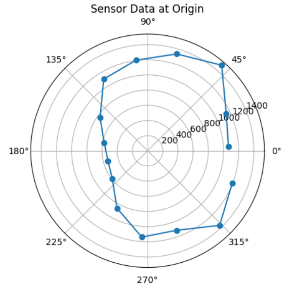
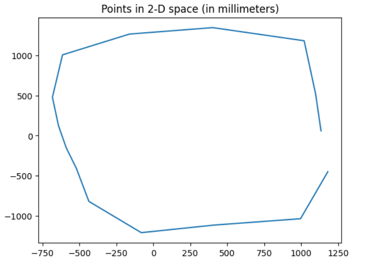
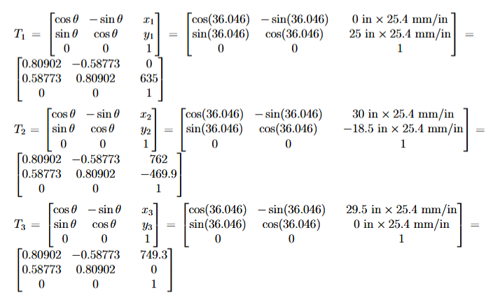
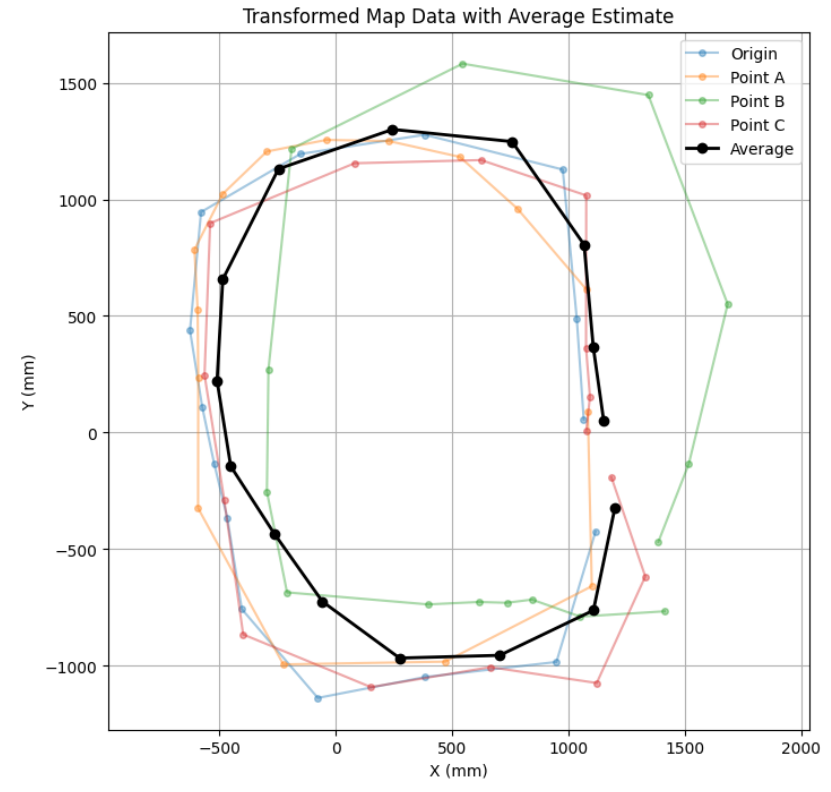
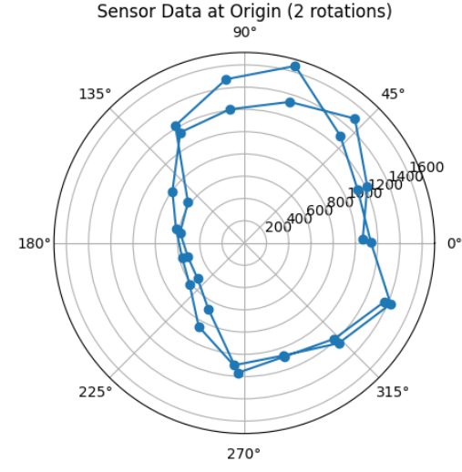
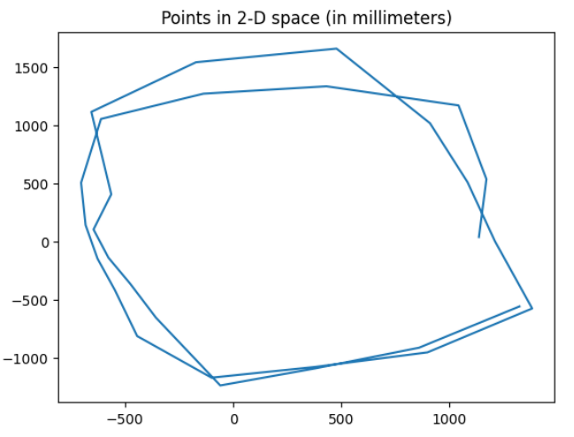

# Lab 9

The objective of this lab is to begin implementing motion planning concepts by using our Time-of-Flight (ToF) sensors to produce a map of the robot's surroundings. 

## Methodology

At a high level, I will use an orientation control approach. The robot will make a full rotation in place in increments of roughly 20 degrees and take distance measurements using the front-facing ToF sensor at each increment. 

To check for sensor and robot position frames, I took some additional measurements using a tape measure and a straightedge with measurements accurate to the nearest 1/16 inch. These were used to find the front-facing ToF sensor frame, visualized in the diagram below:

Here I take the robot's center as the origin (0,0), with the x-axis running along the robot's long side and the y-dimension along the short side. The front-facing ToF sensor is well-centered in the y-dimension, so I took this coordinate to be 0. The robot's long side is 7 inches long, and the front-facing ToF sensor is roughly 0.75 inch from the front of the robot, so this sensor is at the point (2.75, 0) in the robot frame. This would result in a simple translation matrix, since the robot and sensor always have the same orientation. Distance measurements taken from this sensor will be adjusted by adding a 2.75 inch offset to my measeurements before plotting on my generated map.

## Procedure

After confirming that my Lab 6 code still works for PID orientation control, I built on top of that for this lab. I lowered the maximum motor speed, since I was expecting to make small rotation movements, and left the other parameters as-is. Using many iterations, the robot would visit multiple angles at increments of 25 degrees. At each point, the robot took a distance measurement with the front-facing ToF sensor and a gyroscope measurement with the IMU's digital motion processor (DMP). The ToF sensor was left in long-distance mode to better fit the conditions of the environment setup. This data was sent to my laptop in polar coordinates, and I added the aforementioned 2.75-inch offset to the distance measurements to generate a graph. 

I used the following experimental setup created using a tape measure, a straightedge, and my floor panels, which happened to be 5 inches in width. The setup uses a set of coordinate axes with positive-x pointing down and positive-y pointing to the right. The robot is shown at the origin point of O with coordinates (0,0). Three observation points of A, B, and C respectively take positions to the right at (0,25), below at (0, 29.5), and in the bottom-left at (-30,18.5). Note that the lines of tape align with the edges of the robot, which is why the points themselves lie where the robot's center would be instead of at the tape intersections. 

I tried to keep the starting orientation consistent at each point using the gyroscope. I applied a consistent setpoint for the robot's current orientation in the photo using a straightedge, and had the robot start its measurements at the same orientation at the observation points. For the PID control, I brought the maximum speed and minimum speed a bit lower to more consistently make the small 24-degree turns, and I settled on a PWM range of [95, 110] and a K_P value of 9. The tight PWM bound was to complmement a less frequent sampling time from waiting for a fresh PWM value instead of estimating based on previous values. 

Also, it seems that the measured yaw from the DMP takes clockwise right-hand turns to be the positive rotation, so I flip all output values so that counterclockwise rotation is positive instead. This shouldn't make a difference in the final output, but it is more consistent with other models. 

Here is a sample video of the data collection process at the origin:
<!-- TODO: data collection video -->
<!-- video link: https://youtu.be/4ujupi-r3Fo-->

This resulted in the following data at each point. It looks like each separate set was able to get a rough idea of what the room shape truly looked like based on their shapes and the location of the origin respective to each plot. 

Origin:

Point A:

Point B:

Point C:

When I collected the raw data, I re-initialized the gyroscope for points A, B, and C with a new setpoint. I averaged the starting points to estimate this setpoint to be 36.046 degrees from the original setpoint on the IMU gyroscope. The pictures above do not yet have this adjustment made, but based on the setup picture, these data seem reasonably consistent with the environment. 

I tried combining these data into one map by applying the following transformation matrices for each point. The transformations that needed to be made were a rotation of 36.046 degrees and a translation to the origin frame from the frames of the respective observation points with aformentioned coordinates. The origin matrix is trivially the identity matrix and is omitted. 

Finally, applying the transformation matrices to the Cartesian-coordinate data, I collected them into one plot for my map. To estimate the actual map, I took an element-wise average of the data points and plotted them as a fifth series. The plot for Point B was notably an outlier trial, which may have been due to extra drift while collecting that particular dataset. 

This map was a fairly reasonable estimate of the shape of the room, but at this resolution of 15 data points, it was unable to detect finer details such as the protruding corner in the negative-x, positive-y corner, or the extra space in the positive-x, negative-y corner at the edge of the cardboard box.

## Error Analysis

My primary sources of error came from the ToF sensor, the constraints of the environment, and the rotation of the robot itself. Per the VL53L1X datasheet from Lab 3, the sensor error is estimated at around 20 millimeters in this environment's lighting. In my environment, my measurements for the positions of the three observation points and the origin were limited by the width of the tape I used to mark their locations. This width was 0.75 inch, so the measurements from these locations may have been confounded by an additional 0.375 inch in any direction. 

For rotation, a possible source of rotational error came from the margin of error permitted for the rotations, which was within 1 degree. Even with slight processing time between angle measurement and stopping time, the measured angles seemed to stay pretty consistently within this bound; still, I tried to minimize this error by remeasuring the angle from the DMP output instead of using the intended angle; for instance, if a rotation intended to terminate at 100 degrees from the setpoint instead terminated at 99.5 degrees, I would record the angle for that data point as 99.5 degrees instead of 100 degrees.

Another source comes from my attempt at orientation consistency. This was hard to quantify, since I would be measuring the angle of the tape itself. It seems reasonable to assume my floorboards and straightedge are very close to rectangular, which would heavily limit variance in my setup, so I considered this factor to have negligible impact on accuracy; however, since I converted world measurements from feet back to millimeters in my data collection, there was rounding error to the nearest 0.1 millimeter.

Next, I wanted to consider multiple rotations to assess consistency. Using the origin as a test case, here I show overlapping data from two consecutive rotations at point A, as wells as an estimation of a "true" point by averaging the angle and distance data for the pair of points measured at each increment. I was unable to do more than two rotations as the connection would time out before data was sent back to my machine. 

<!-- TODO: multiple rotations diagram -->

The central axis of the robot adjusted with each measurement as the wheels were not rotating at exactly the same speed. To find this error, I considered the difference in multiple-rotation measurements in the positive x- and y-directions. After 5 trials, although I was expecting the radius from the starting point to increase as the right set of wheels turns faster than the left, I was not able to find a consistent radial difference. There was a somewhat consistent ~200 millimeter average offset in the positive y-direction, but this seemed inconsistent with the mechanics of the movement because the robot is rotating in a circle instead of making lateral translations, and it seems more reasonable to interpret a more gradual change in measurement over the full rotation. For these reasons, I ended up not incorporating such an adjustment into my map; although, making two or three rotations would add more consistency to the data as the robot makes multiple passes over the same spots. 